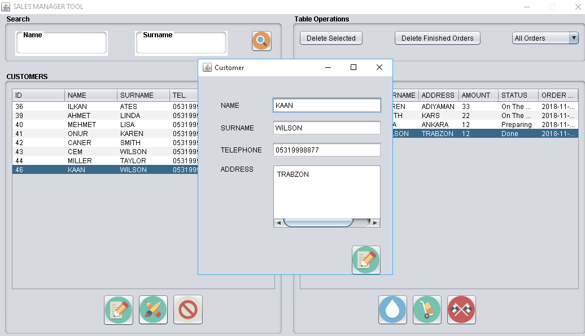
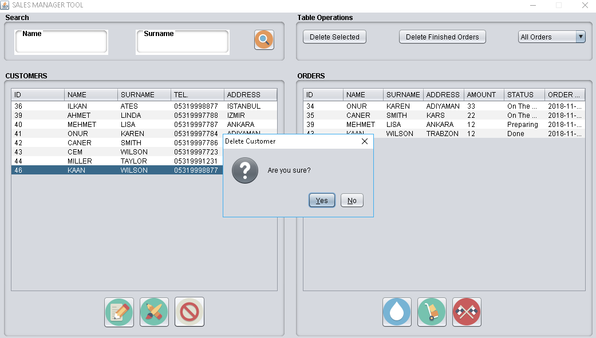
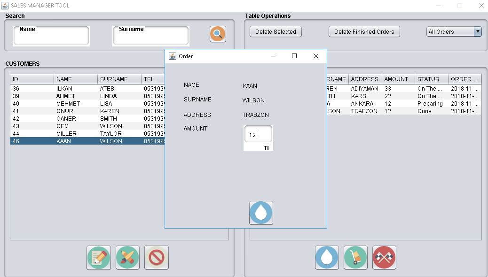
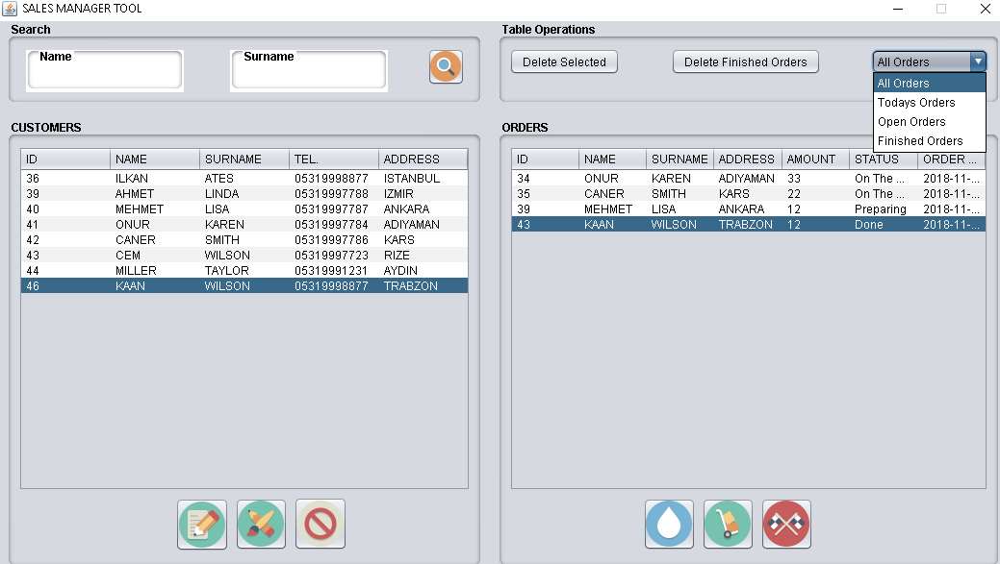

# SALES MANAGEMENT TOOL

Sales management tool can be used to manage accounts and orders. Developed with Java and MySQL. Written by Ilkan Ates. 

### FUNCTIONS
1. Add customer with name, surname, telephone and address.
2. Edit customer information.
3. Delete customer.
4. Add order with amount by selecting customer
5. Delete order
6. Change status as preparing, on the way and done.
7. Delete finished orders.
8. Filter orders by date and status.

### SCREENSHOTS

1. Add customer with name, surname, telephone and address.

2. Edit customer information.

3. Delete customer.

4. Add order with amount by selecting customer

5. Delete order

7. Delete finished orders.

8. Filter orders by date and status.

